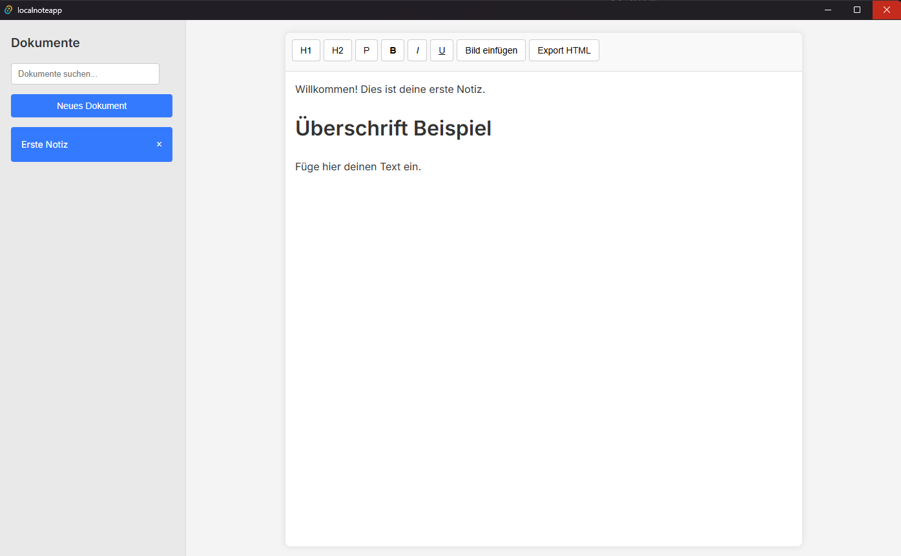

# Local Note App

A simple note-taking application built with HTML, CSS, and vanilla JavaScript. This application allows you to create, edit, and manage your notes locally in your browser **or** as a desktop application using [Tauri](https://tauri.app/).

## Features

- **Rich Text Editing**: Format notes with headings, paragraphs, bold, italic, and underline.
- **Document Management**: Create, rename, and delete documents.
- **Image Support**: Insert images via URL or upload.
- **Local Storage**: All your documents are saved in the browser's local storage, ensuring your data persists between sessions.
- **Search Functionality**: Quickly find documents using the search bar.
- **HTML Export**: Export your documents as HTML files.
- **Responsive Design**: Adapts to various screen sizes.

## Download

Download the file under "Releases" to install and run the application locally.

## Screenshot



## How It Works

The application is designed to work both as a web app and a desktop application:
- **Frontend**: Built with vanilla HTML, CSS, and JavaScript.
    - `index.html`: The main structure of the application.
    - `style.css`: Styles for the application, providing a clean and modern user interface.
    - `script.js`: Handles all the application logic, including document management, editor functionality, local storage interaction, and UI updates.
- **Data Storage**: Uses the browser's `localStorage` API to store and retrieve documents.
- **Editor**: A `contenteditable` div is used as the rich text editor, with JavaScript handling formatting commands.
- **Desktop Application**: When built with Tauri, the web application is packaged into a native desktop application with access to native features while maintaining its web-based core functionality.

## Getting Started

### Web Application
1. Clone this repository or download the source code.
2. Open the `index.html` file in your web browser.

No build steps are required to run the web version.

### Desktop Application (Tauri)
To build and run the application as a desktop app with Tauri:

1. **Prerequisites**:
   - Install [Node.js](https://nodejs.org/) (v14+)
   - Install [Rust](https://www.rust-lang.org/tools/install)
   - Set up the Tauri development environment by following the [official prerequisites guide](https://tauri.app/v1/guides/getting-started/prerequisites)

2. **Setup**:
   ```bash
   # Clone the repository
   git clone <repository-url>
   cd LocalNoteApp
   
   # Initialize Tauri in the project (if not already done)
   npm create tauri-app@latest
   # Follow the prompts and select appropriate options
   ```

3. **Development**:
   ```bash
   # Run in development mode
   npm run tauri dev
   ```

4. **Building**:
   ```bash
   # Build the application
   npm run tauri build
   ```
   This will create executables for your platform in the `src-tauri/target/release` directory.

## Recommended IDE Setup (for Tauri development)

If you plan to develop or build this as a Tauri desktop application:

- [VS Code](https://code.visualstudio.com/) + [Tauri](https://marketplace.visualstudio.com/items?itemName=tauri-apps.tauri-vscode) + [rust-analyzer](https://marketplace.visualstudio.com/items?itemName=rust-lang.rust-analyzer)

Refer to the Tauri documentation for more information on building and developing Tauri applications.
